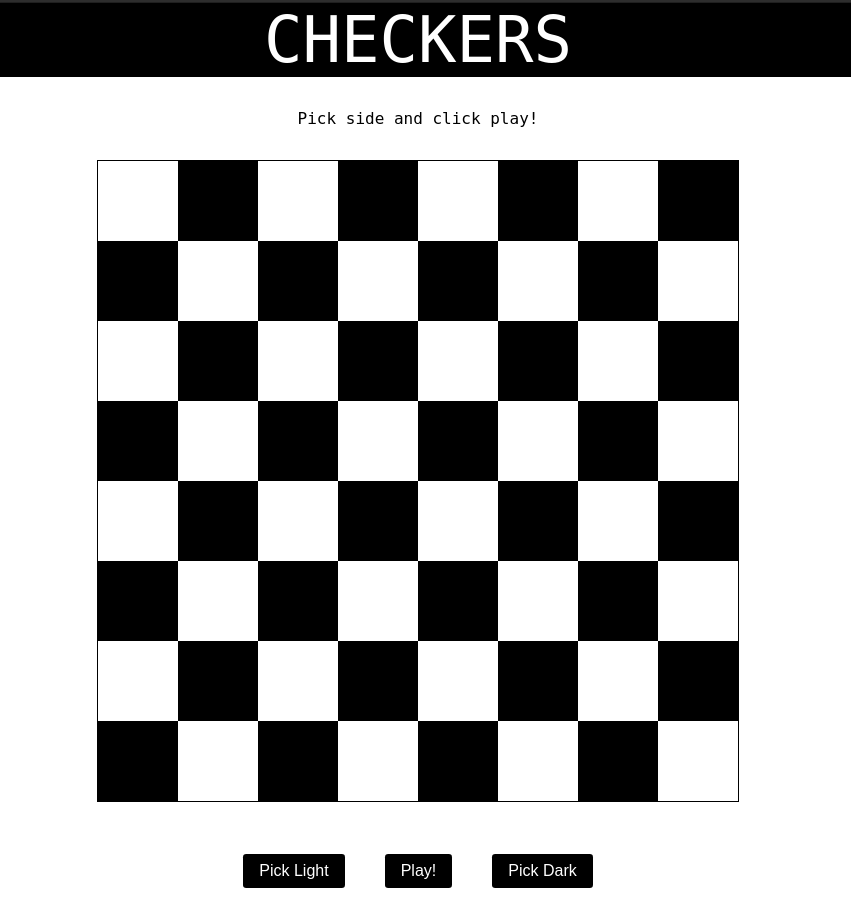
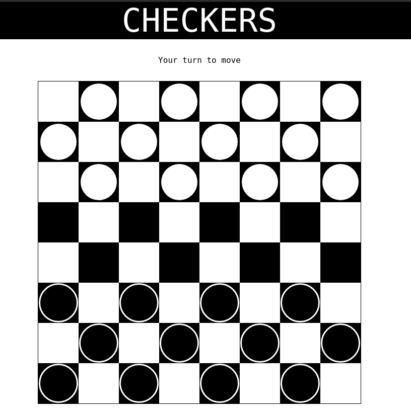

# Checkers
Browser based checkers game with AI opponent. This is a project (exercise 4) for EARIN course on WUT. 
Repo for other tasks available [here](https://github.com/kamieniarzk/artificial-inteligence-course).

## Run
To run the game in linux environment: 
* clone this repo, then go to the `backend` directory and execute `./start.sh`. This will start the `Python` server on port 8000. 
* go to the `frontend` directory and execute the following commands `npm install` and then `npm start` (make sure you have `node` installed, if not download from [this website](https://nodejs.org/en/))

## Technology stack
The game engine is based in `Python`, with the frontend written in React using `TypeScript`. The communication between the frontend and backend is established using websockets implementation `socket.io` in `Python` and a client on the frontend side.

## User interface
Initially the user is presented with a black-white 8x8 checkerboard, the white pieces are on the bottom part of the screen and the black ones are at the top. The user is prompted with buttons to choose either the light or dark side. After hitting play, the light side gets the first move (either the user gets the move or the AI depending on initial user's choice). 

## AI
The AI implemented in this game is based on min-max algorithm with alfa-beta pruning.

## Game rules
* Each player begins the game with 12 colored discs (one set of pieces is black and the other white).
* The board consists of 64 squares, alternating between 32 dark and 32 light squares. Eachplayer has a light square on the right side corner closest to him or her.
* Each player places his or her pieces on the 12 dark squares closest to him or her.
* White moves first. 
* Moves are allowed only on the dark squares, so pieces always move diagonally. 
* Single pieces are always limited to forward moves.
* A piece making a non-capturing move (not involving a jump) may move only one square. A piece making a capturing move (a jump) leaps over one of the opponent's pieces, landing in a straight diagonal line on the other side. Only one piece may be captured in a single jump; however, multiple jumps are allowed on a single turn.
* When a piece is captured, it is removed from the board.
* If a player is able to make a capture -the jump must be made. If more than one capture is available, the player is free to choose whichever he or she prefers.
* When a piece reaches the furthest row from the player who controls that piece, it is crowned and becomes a king.
* Kingsare limited to moving diagonally, but maymove both forward and backward. 
* A player wins the game when the opponent cannot make a movebecause:a.all of the opponent's pieces have been capturedb.all of the opponent's pieces are blocked in

